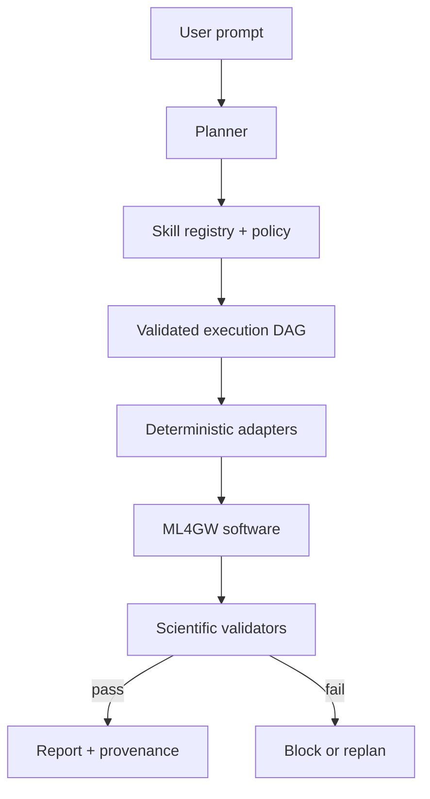

# Architecture

## System boundary

ML4GW Agent separates decisions from scientific execution.



| Component | Responsible for | Must not do |
|---|---|---|
| Planner | Intent, tool selection, dependencies, conditions | Numerical inference or arbitrary shell execution |
| Registry | Declared capabilities and contracts | Guess undocumented repository behavior |
| Policy | Cost/risk limits, approvals, adapter availability | Override scientific preconditions |
| Adapter | Translate a typed call to a fixed Python/CLI/Law/Snakemake interface | Accept arbitrary commands from a model |
| Validator | Schema, artifact, and eventually scientific checks | Treat exit code zero as scientific success |
| Provenance | Inputs, versions, command vector, outputs, hashes, state | Store credentials or hidden reasoning |

## Skill contract

Every skill manifest declares:

- A dotted, versioned capability name.
- JSON Schema for inputs and outputs.
- A fixed adapter type and entrypoint.
- Human-readable and machine-checkable preconditions.
- Required output validations.
- CPU, memory, GPU, and runtime expectations.
- Risk, approval, maturity, upstream repository, and reproducibility notes.

The registry validates every YAML manifest and both JSON Schemas at startup.
Unknown or duplicate skills are rejected.

## Plans and task references

A plan is a validated directed acyclic graph. Each task has a stable ID, one
registered skill, typed parameters, dependencies, an optional condition, and a
small retry bound. Only exact typed references are accepted:

```text
${fetch_data.outputs.strain_artifact}
```

Embedded string interpolation and free-form expressions are intentionally not
supported. This keeps the dataflow inspectable and prevents an LLM from turning
an upstream string into a command fragment.

Task states are:

```text
pending → running → completed
                  ↘ failed
pending → skipped
pending → blocked
running → cancelled
```

The manifest is atomically checkpointed after every state transition. Reporting
tasks may opt into `allow_failed_dependencies` so a partial-failure report is
still produced.

## Execution modes

`mock` mode runs deterministic simulated adapters. Every output and report is
marked as non-scientific. It validates orchestration without data credentials,
model weights, a GPU, or heavyweight ML4GW environments.

`real` mode is fail-closed:

- `planned` adapters block the entire plan before the first task starts.
- Model revisions must be immutable unless the operator explicitly relaxes the
  policy.
- High-risk skills require explicit approval.
- The Buoy executable must be installed.
- All subprocesses use an argument vector and `shell=False`.
- Artifact paths must remain inside the run directory; symlink artifacts are
  rejected.

## Buoy vertical slice

For a generic request such as `Analyze GW150914`, v0.1 generates:


The adapter follows Buoy's current public interface:

```text
buoy --events GW150914 --outdir <controlled-run-directory> ...
```

Buoy performs event/data resolution, Aframe inference, coalescence-time
selection, AMPLFI inference, plots, and optional HTML generation. The adapter
collects its documented output tree and records package version, model
revisions, command vector, logs, files, and checksums.

## Composed analysis baseline

An explicit request for data quality, Aframe, AMPLFI, GWAK, or DeepClean creates
a decomposed plan. The current deterministic baseline can exercise this plan in
mock mode. Real adapters are introduced phase by phase.

DeepClean is intentionally preceded by `deepclean.check_applicability`.
The v0.1 baseline reports applicability but does not schedule cleaning. A future
branch may use cleaned strain only after witness channels, coupling
configuration, and compatible immutable weights have all been verified.

## Provenance

Each run directory includes `run_manifest.json`, which records:

- Original prompt and complete plan.
- Task parameters after reference resolution.
- Task state, timing, attempts, validation, and errors.
- Adapter metadata and exact command vector.
- Relative artifact paths, sizes, media types, and SHA-256 hashes.
- Python/platform information and explicit reproducibility warnings.

Credentials and unrestricted environment dumps are not recorded.

## Deliberate non-goals in v0.1

- No unrestricted shell tool.
- No claim that mock scores or posteriors are scientific.
- No autonomous long-duration observing-run scan.
- No automatic DeepClean inference without witness/coupling checks.
- No LLM planner until deterministic contracts, policies, and benchmarks are
  stable enough to measure it against a reproducible baseline.
