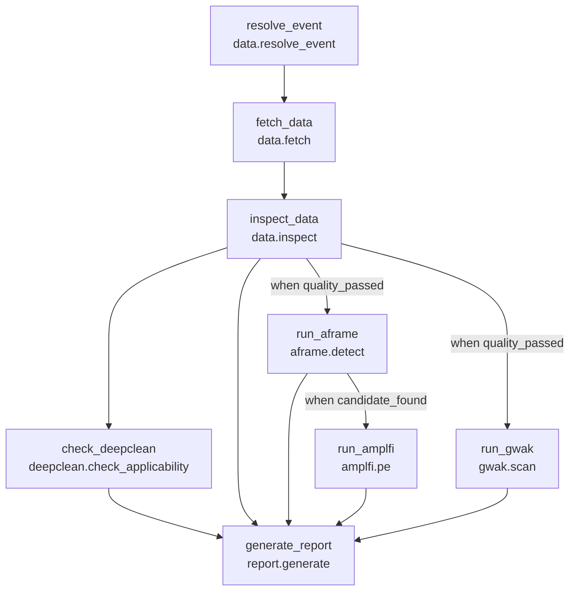
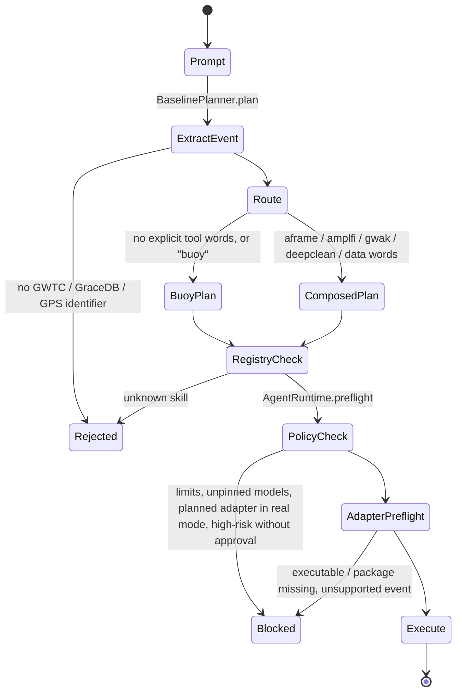

# ML4GW Agent v0.1 technical design

This document is the concrete counterpart to the project's positioning
statement:

> ML4GW has already built many of the individual AI capabilities required
> for gravitational-wave discovery. The missing layer is an intelligent
> scientific orchestration system that can understand a research goal,
> compose these capabilities, execute them across heterogeneous computing
> environments, validate intermediate results, and produce reproducible
> scientific conclusions.

It records, for the code that exists in this repository today, every
skill name and its input/output contract, the DAG data structure, the
planner and task state machines, the prompt that a future LLM planner
must satisfy, the end-to-end `Analyze GW150914` execution trace, and a
gap map from the design principles to the implementation.

The governing rule is unchanged:

> The LLM decides *what* to do. Deterministic scientific software decides
> *how* it is done. Validators decide whether the result is acceptable.
> Provenance makes the run reproducible.

## 1. Layer map

| Design layer | Module | State in v0.1 |
|---|---|---|
| Scientific planner / reasoner | `planning.py` (`BaselinePlanner`) | Deterministic keyword router. LLM planner is Phase 5. |
| Skill registry ("what can I actually execute?") | `registry.py`, `skill_manifests/*.yaml` | Ten validated contracts. |
| Policy layer | `policy.py` (`ExecutionPolicy`) | Task count, data window, sample count, model pinning, high-risk approval. |
| Adapter / executor | `adapters/` (`builtin`, `mock`, `buoy`) | Buoy CLI is the only real scientific adapter. |
| Scientific validator | `validation.py`, per-skill `validations:` | JSON Schema plus artifact checks. Physics-level checks are Phase 1b onward. |
| Provenance | `provenance.py`, `RunManifest` | Atomic checkpointed manifest, SHA-256 artifacts, command vector. |
| Interfaces | `cli.py` | `skills`, `plan`, `validate-plan`, `run`, `run-plan`, `doctor`. |
| Memory / replanner | none | Phase 5 (see section 8). |
| Compute planner | none | Phase 4. Resource needs are declared per skill but not yet acted on. |

## 2. Skill catalog

All skills live in `src/ml4gw_agent/skill_manifests/` and are loaded by
`load_default_registry()`. Each manifest is a `SkillSpec`
(`models.py`) with JSON Schema 2020-12 input and output contracts that are
checked at registry load and again at every task boundary.

| Skill | Adapter | Status | Risk | GPU | Purpose |
|---|---|---|---|---|---|
| `data.resolve_event` | builtin | stable | low | none | Validate event identifier, classify source, attach catalog time when known |
| `data.fetch` | planned (mldatafind or GWOSC) | planned | medium | none | Retrieve strain for a bounded window |
| `data.inspect` | planned (GWPy checks) | planned | low | none | Detector availability, finite strain, duration, science mode |
| `buoy.analyze` | buoy_cli | experimental | medium | preferred | Event to Aframe to AMPLFI vertical pipeline |
| `aframe.detect` | planned | planned | medium | preferred | CBC candidate detection |
| `amplfi.pe` | planned | planned | medium | preferred | Likelihood-free parameter estimation |
| `gwak.scan` | planned (Snakemake) | planned | medium | required | Unmodeled anomaly scan |
| `deepclean.check_applicability` | planned | planned | low | none | Witness / coupling / model support decision |
| `deepclean.clean` | planned (Law) | planned | high, approval required | required | Noise subtraction |
| `report.generate` | builtin | stable | low | none | Markdown report from recorded task state |

"Planned" adapters run only in mock mode. In real mode the policy layer
blocks the whole plan before the first task starts.

### 2.1 Input and output contracts

Every output contract carries a mandatory `simulated: boolean` so a mock
value can never be mistaken for a scientific one downstream.

**`data.resolve_event`**

```text
in:  event: string | number(>=1e8)
out: event: string
     event_kind: gwtc | gracedb_event | gracedb_superevent | gps
     catalog_time: number | null
     delegated_resolution: boolean   # true when a downstream tool must resolve metadata
     simulated: boolean
```

**`data.fetch`**

```text
in:  event: string
     ifos: [H1|L1|V1|K1]+ (unique)
     window_seconds: 1..4096 (default 64)
     sample_rate: 1024|2048|4096|8192|16384
out: strain_artifact: path (inside run dir)
     ifos: [string]
     gps_start, gps_end: number
     source: string
     simulated: boolean
validations: strain_artifact exists and is non-empty
```

**`data.inspect`**

```text
in:  strain_artifact: path
     require_science_mode: boolean (default true)
out: quality_passed: boolean
     available_ifos: [string]
     diagnostics_artifact: path
     issues: [string]
     simulated: boolean
validations: quality_passed present; diagnostics_artifact exists
```

**`buoy.analyze`**

```text
in:  event: string | number
     samples_per_event: 100..100000 (default 20000)
     nside: 16|32|64|128|256 (default 64)
     min_samples_per_pix: 1..100 (default 5)
     use_distance: boolean (default true)
     use_true_tc_for_amplfi: boolean (default false)
     ifos: 1..3 of [H1, L1, V1]
     device: cpu | cuda
     seed: integer | null
     aframe_revision, amplfi_revision: string | null   # required in real mode by policy
     runner: cli | python (default cli)
out: event: string
     output_directory, aframe_output, posterior_samples: path
     plots: [path]
     summary_html: path | null
     detection_statistic: number | null
     predicted_coalescence_time: number | null
     simulated: boolean
validations: aframe_output and posterior_samples exist and are non-empty
```

**`aframe.detect`**

```text
in:  strain_artifact: path
     ifos: [H1, L1] (min 2)
     model_revision: string        # "UNPINNED" is blocked in real mode
     threshold: number (optional)
out: candidate_found: boolean
     candidate_times: [number]
     predicted_coalescence_time: number | null
     detection_statistic: number
     output_artifact: path
     simulated: boolean
validations: detection_statistic present; output_artifact exists
```

**`amplfi.pe`**

```text
in:  strain_artifact: path
     coalescence_time: number      # typically ${run_aframe.outputs.predicted_coalescence_time}
     ifos: 2..3 of [H1, L1, V1]
     model_revision: string
     samples: 100..100000 (default 20000)
out: posterior_artifact: path
     credible_intervals: object
     skymap_artifact: path
     simulated: boolean
validations: posterior_artifact exists and is non-empty
```

**`gwak.scan`**

```text
in:  strain_artifact: path
     model_revision: string
     top_k: 1..1000 (default 10)
out: anomaly_found: boolean
     top_segments: [object]
     anomaly_artifact: path
     simulated: boolean
validations: anomaly_artifact exists
```

**`deepclean.check_applicability`**

```text
in:  event: string
     strain_artifact: path
     ifos: 1+ of [H1, L1, V1]
out: applicable: boolean
     reasons: [string]
     witness_artifact, coupling_config, model_revision: string | null
     simulated: boolean
validations: applicable present
```

**`deepclean.clean`** (high risk, `requires_approval: true`)

```text
in:  strain_artifact, witness_artifact, coupling_config: path
     model_revision: string
     ifo: H1 | L1 | V1
out: cleaned_strain_artifact, subtraction_diagnostics: path
     applicable: boolean
     simulated: boolean
validations: applicable present; both artifacts exist
```

**`report.generate`**

```text
in:  title: string (optional)
out: report_path: path
     simulated: boolean
validations: report_path exists and is non-empty
```

### 2.2 Preconditions

Each manifest lists `preconditions` with a human description and a
`machine_check` identifier. In v0.1 the identifiers are declarative: they
name the check an adapter's `preflight()` is expected to perform. The
Buoy adapter implements `executable:buoy`, `requested_device`, and the
credential warning for GraceDB identifiers. The remaining identifiers
(`aframe_compatible_input`, `amplfi_model_support`,
`gwak_compatible_input`, `deepclean_witness_channels`,
`deepclean_coupling`, `deepclean_model_support`, `bounded_data_window`,
`input_artifact`, `pinned_model_revision`) are the contract that each
real adapter must satisfy when it lands. The precondition list is the
"precondition reasoning" surface the planner will read in Phase 5.

## 3. DAG data structure

A plan is a `PlanSpec` (`models.py`), validated on construction.

```text
PlanSpec
  schema_version: "1.0"
  id: plan_<12 hex>
  prompt: string
  goal: string
  planner: string            # "baseline-deterministic-v0.1" today
  created_at: datetime
  warnings: [string]
  tasks: [TaskSpec]  (>= 1)

TaskSpec
  id: ^[a-z][a-z0-9_]*$      # unique in the plan
  skill: registered skill name
  parameters: {string: value | reference}
  depends_on: [task id]
  when: ConditionSpec | null
  max_retries: 0..3
  allow_failed_dependencies: boolean

ConditionSpec
  reference: "${<task_id>.outputs.<dotted.path>}"
  operator: exists | equals | not_equals | gt | gte | lt | lte | truthy
  value: any
```

Validation rules enforced by `PlanSpec.validate_graph`:

- Task ids are unique.
- Every dependency names an existing task.
- No task depends on itself.
- A Kahn topological sort succeeds; a cycle is a validation error.
- Every `skill` must exist in the registry (`validate_plan_skills`).

Dataflow uses exact typed references only:

```text
${fetch_data.outputs.strain_artifact}
${run_aframe.outputs.predicted_coalescence_time}
```

The regular expression in `runtime.py` accepts nothing else. String
interpolation and expressions are deliberately unsupported so that an
upstream string can never become a command fragment. A reference to a
task that is not `completed` fails the referencing task.

Example: the composed plan produced for the prompt
`Analyze GW150914, check data quality, use DeepClean if appropriate, run
Aframe and AMPLFI parameter estimation, then scan anomalies with GWAK.`



`generate_report` sets `allow_failed_dependencies: true`, so an audit
report is written even when an upstream task fails or is skipped.

## 4. State machines

### 4.1 Planning and admission



Routing rules of the deterministic baseline (`planning.py`):

| Prompt contains | Effect |
|---|---|
| `aframe`, `cbc detection`, `并合检测`, ... | `aframe.detect` after `data.inspect`, conditioned on `quality_passed` |
| `amplfi`, `parameter estimation`, `参数估计`, ... | `amplfi.pe` after `aframe.detect`, conditioned on `candidate_found`; implies Aframe |
| `gwak`, `anomaly`, `unusual`, `异常`, ... | `gwak.scan` in parallel with Aframe |
| `deepclean`, `noise subtraction`, `去噪`, ... | `deepclean.check_applicability` only; `deepclean.clean` is never scheduled by the baseline |
| `data quality`, `strain data`, `数据质量`, ... | data path without ML tools |
| none of the above, or `buoy` | Buoy vertical slice |
| no event identifier | `PlanningError`, fail closed |

### 4.2 Task lifecycle

```text
pending --> running --> completed
                    \-> failed          (adapter error, schema or artifact validation failure)
pending --> skipped                     (condition false, or a dependency was skipped)
pending --> blocked                     (policy/preflight blocker, failed dependency, unevaluable condition)
running --> cancelled                   (operator interrupt; checkpointed before re-raising)
```

Per task the runtime performs, in order: dependency gate, condition
evaluation, reference resolution, input schema validation, adapter
preflight, `describe_invocation` (command vector written to the manifest
before execution), bounded retries of `execute`, output schema
validation, per-skill artifact validation, artifact hashing. The manifest
is rewritten atomically after every transition.

### 4.3 Run lifecycle

```text
pending --> blocked                      (preflight failed; every task marked blocked, attempts == 0)
pending --> running --> completed        (no failed / blocked / cancelled tasks)
                    \-> failed           (any task failed)
                    \-> blocked          (a task was blocked, none failed)
                    \-> cancelled        (operator interrupt)
```

## 5. LLM planner contract and prompt (Phase 5 target)

The LLM planner replaces `BaselinePlanner.plan()` and nothing else. Its
only permitted output is a JSON document that validates as `PlanSpec`.
The registry, policy, adapters, validators, and provenance are unchanged,
so the planner can be measured against the deterministic baseline with the
benchmark in `benchmarks/v0_prompts.yaml`.

Registry summaries given to the model contain, per skill: name, purpose,
input schema, output schema, preconditions, resources, risk, status. The
model never sees repository source code or shell entrypoints.

System prompt (draft, to be versioned alongside the benchmark):

```text
You are the planning component of ML4GW Agent, a scientific orchestration
layer for gravitational-wave machine-learning tools.

You decide WHAT scientific steps to run. You never decide HOW a tool is
invoked, and you have no shell. You may only use the skills listed in the
CAPABILITY REGISTRY below, with exactly the parameters their input schema
allows.

Output a single JSON object that validates as PlanSpec (schema below). No
prose outside the JSON.

Rules:
1. Bound the scope. Every plan must resolve to a specific event or a
   bounded GPS window. If the request is unbounded (for example "scan all
   of O3"), return {"error": "..."} explaining what is needed.
2. Respect preconditions. Schedule a skill only after the skills that
   satisfy its preconditions. Parameter estimation (amplfi.pe) requires a
   validated coalescence time; obtain it from aframe.detect or from a
   trusted input, never by guessing.
3. Make branches explicit with `when` conditions on upstream outputs.
   Run amplfi.pe only when candidate_found is true. Run analyses that
   need clean data only when quality_passed is true.
4. DeepClean: schedule deepclean.check_applicability first. Never
   schedule deepclean.clean unless the applicability output is true and
   witness_artifact, coupling_config, and model_revision are all present.
5. Pass data between tasks only with exact references of the form
   ${task_id.outputs.field}. Do not embed references inside strings.
6. Pin immutable model revisions when the operator supplied them. If a
   revision is unknown, use the literal "UNPINNED" and add a warning; the
   policy layer will block real execution.
7. Choose tools by scientific intent:
     find compact binary mergers      -> aframe.detect
     estimate source parameters       -> amplfi.pe
     look for unmodeled / unusual     -> gwak.scan
     study or subtract detector noise -> deepclean.check_applicability
     quick end-to-end event analysis  -> buoy.analyze
8. Always end with report.generate that depends on every terminal task
   and sets allow_failed_dependencies to true.
9. Declare cost. Prefer the smallest plan that answers the request; note
   in warnings when a step needs a GPU or distributed execution.
10. State the goal in one sentence in `goal`. Put every assumption and
    every unresolved uncertainty in `warnings`.

CAPABILITY REGISTRY:
<registry summaries inserted here>

PLANSPEC JSON SCHEMA:
<PlanSpec.model_json_schema() inserted here>
```

Observation and reflection (also Phase 5) reuse the same boundary. After
each task the runtime will hand the model a structured observation
(outputs, validation records, warnings, artifact list) and accept only a
bounded replan: append or skip tasks in the existing `PlanSpec`, never
modify parameters of completed tasks, never exceed `ExecutionPolicy`
limits. The canonical discrepancy case from the design, "Aframe negative
but GWAK positive", must resolve to morphology diagnostics rather than
parameter estimation; that decision is expressed as a `when` condition
on `candidate_found` and a new diagnostic task, not as free text.

## 6. End-to-end trace: `Analyze GW150914`

Command:

```bash
uv run ml4gw-agent run "Analyze GW150914" --mode real --runs-dir ./runs \
  --aframe-revision 3c947f6ded4a8b4b5a5dd7620d3e2e710e1716f4 \
  --amplfi-revision 8b97d2f8459d04924cb010dfee0262260bf3da80
```

1. **Plan.** `extract_event` finds `GW150914`. No tool words are present,
   so the Buoy vertical slice is chosen:
   `resolve_event -> analyze_event -> generate_report`.
2. **Admission.** `ExecutionPolicy.validate` confirms task count, sample
   count, both Buoy revisions present (real mode), and no high-risk skill.
   `BuoyCLIAdapter.preflight` confirms the `buoy` executable exists,
   warns if `nvidia-smi` is absent, and rejects any event string that does
   not match the identifier pattern.
3. **`resolve_event`.** Builtin adapter classifies the identifier as
   `gwtc`, attaches the catalog time 1126259462.4, writes
   `artifacts/resolve_event/event_info.json`.
4. **`analyze_event`.** The command vector is recorded before execution:

   ```text
   buoy --events GW150914 --outdir <run>/artifacts/analyze_event/buoy-output
        --samples_per_event 20000 --nside 64 --min_samples_per_pix 5
        --use_distance true --use_true_tc_for_amplfi false --device cuda
        --run_aframe true --run_amplfi true --generate_plots true --to_html true
        --ifos ["H1", "L1"] --seed 0
        --aframe_revision 3c947f6d... --amplfi_revision 8b97d2f8...
   ```

   It runs with `shell=False`, a 7200 s hard timeout, stdout and stderr
   streamed to `logs/analyze_event.*.log`. Buoy resolves the event,
   fetches public data, runs Aframe, selects the coalescence time, runs
   AMPLFI, and writes plots and `summary.html`. The adapter collects
   `data/aframe_outputs.hdf5`, `data/posterior_samples.dat`, `plots/*`,
   `summary.html`, reads the peak `signif_integrated` value and
   `predicted_tc` when `h5py` is available, and records the installed
   `ml4gw-buoy` version.
5. **Validation.** Output JSON Schema, then `aframe_output` and
   `posterior_samples` must exist, be non-empty, be regular files, and
   resolve inside the run directory.
6. **`generate_report`.** Writes `report.md` with the workflow table and
   every recorded output, marked as real because mode is `real`.
7. **Provenance.** `run_manifest.json` holds the prompt, the full plan,
   resolved parameters, per-task status and timing, validation records,
   command vector, adapter metadata, SHA-256 of every artifact, and the
   Python/platform environment.

The same prompt in `--mode mock` produces the same DAG, the same manifest
shape, and simulated outputs whose every value and file is marked
`SIMULATED FOR ORCHESTRATION TESTING; NOT A SCIENTIFIC RESULT`.

The real run has been attempted once; it reached data acquisition and was
stopped by an external GWOSC outage. See `REAL_RUN_2026-09-02.md`.

## 7. Safety boundary

- The planner's only output is a `PlanSpec`; it has no shell tool.
- Every adapter constructs a fixed argument vector; Buoy runs with
  `shell=False`, a hard timeout, and a controlled `--outdir`.
- Event identifiers are pattern-checked in the planner, in the builtin
  resolver, and again in the Buoy adapter.
- `ExecutionPolicy` blocks in real mode: planned adapters, `UNPINNED`
  model revisions, missing Buoy revisions, high-risk skills without
  approval, oversized data windows, oversized sample counts, more than 30
  tasks.
- Artifacts must be regular files inside the run directory; symlinks and
  path escapes fail validation.
- Credentials and environment dumps are never written to the manifest.

## 8. Design principles to implementation map

| Principle from the design notes | Status | Where |
|---|---|---|
| Orchestration layer, not a second pipeline | Done | Adapters wrap Buoy; no numerics in this repo |
| Unified skill contract (`skill.yaml`) | Done | `SkillSpec`, ten manifests |
| Skill / executor separation | Done | `SkillSpec.adapter` vs `adapters/` |
| Capability registry instead of source dumps | Done | `SkillRegistry`, `ml4gw-agent skills --json` |
| Typed tool calls, policy layer, no unrestricted shell | Done | `policy.py`, `runtime.py`, argument vectors |
| Plan as a DAG with task states | Done | `PlanSpec`, `TaskStatus` |
| Conditional execution | Done | `ConditionSpec`, `when` |
| Precondition reasoning | Partial | Declared in manifests; enforced by Buoy preflight only |
| DeepClean is not run unconditionally | Done (guard) | `deepclean.check_applicability` scheduled, `deepclean.clean` never auto-scheduled |
| Observation beyond exit code | Partial | Schema and artifact checks; `signif_integrated` read from HDF5; no physics thresholds |
| Provenance manifest and report | Done | `run_manifest.json`, `report.md` |
| Buoy-first MVP, then decomposed skills | Done / next | Buoy adapter real; Aframe, AMPLFI, GWAK, data adapters are Phase 1b to 2 |
| Compute cost awareness | Declared only | `ResourceSpec` per skill; no scheduler decision yet |
| Compute planner (HTCondor, K8s, Triton) | Not started | Phase 4 |
| Infrastructure and external tools (GraceDB, GWOSC, GCN, ADS) | Not started | Buoy handles GWOSC/GraceDB internally |
| LLM planning, reflection, replanning | Not started | Phase 5; contract and prompt in section 5 |
| Experiment memory | Not started | Phase 5 |
| Benchmark | Seed | `benchmarks/v0_prompts.yaml`, ten cases |
| MCP-style tool bus | Not started | Registry summaries are already the natural tool descriptions |

## 9. Immediate next work (Phase 1b)

1. Real `data.fetch` adapter over GWOSC public data (mldatafind for LDG
   later), writing an HDF5 strain artifact inside the run directory.
2. Real `data.inspect` adapter with finite-strain, duration, and segment
   checks; a `quality_passed` that Aframe and GWAK conditions can trust.
3. Real `aframe.detect` adapter over the supported Aframe inference
   entrypoint with a frozen model/preprocessing compatibility record.
4. Real `amplfi.pe` adapter with detector and parameter-range support
   checks, reading `coalescence_time` from the Aframe output reference.
5. Scientific validators: finite statistics, timestamps inside the
   requested interval, posterior sample shape, detector availability.
6. A five-event acceptance suite compared numerically against direct Buoy
   runs, then the GW150914 real run recorded in `V0_ACCEPTANCE.md`.
